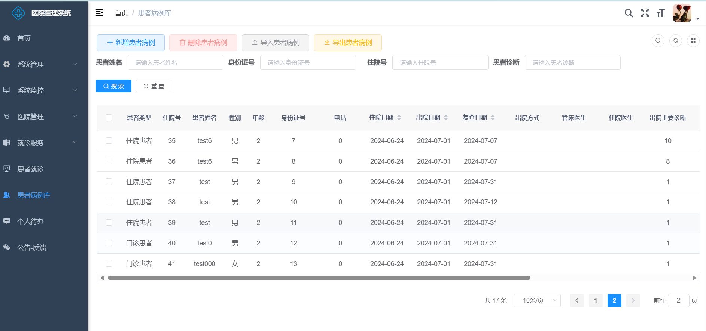

## 项目简介

基于若依前后端分离版框架实现的医院患者信息管理系统，主要包含系统管理，药品进销存，看病就诊，收费管理，患者就诊问询，数据统计，慢病管理，医生每日待办等核心模块
# 医院信息管理系统，实现医院挂号，患者就诊，慢病管理，患者病理科管理，实现患者病例本地导入，对接医院门诊挂号系统，完成患者就诊服务等功能 实现分科室患者就诊，可用于医院管理系统
可提供技术支持

## 内置功能
# 医院信息管理系统，实现医院挂号，患者就诊，慢病管理，患者病理科管理，实现患者病例本地导入，对接医院门诊挂号系统，完成患者就诊服务等功能 实现分科室患者就诊，可用于医院管理系统
# 实现功能如下图所示
1. 用户管理：用户是系统操作者，该功能主要完成系统用户配置。
2. 部门管理：配置系统组织机构（公司、部门、小组），树结构展现支持数据权限。
3. 岗位管理：配置系统用户所属担任职务。
4. 菜单管理：配置系统菜单，操作权限，按钮权限标识等。
5. 角色管理：角色菜单权限分配、设置角色按机构进行数据范围权限划分。
6. 字典管理：对系统中经常使用的一些较为固定的数据进行维护。
7. 参数管理：对系统动态配置常用参数。
8. 通知公告：系统通知公告信息发布维护。
9. 操作日志：系统正常操作日志记录和查询；系统异常信息日志记录和查询。
10. 登录日志：系统登录日志记录查询包含登录异常。
11. 在线用户：当前系统中活跃用户状态监控。
12. 定时任务：在线（添加、修改、删除)任务调度包含执行结果日志。
13. 代码生成：前后端代码的生成（java、html、xml、sql）支持CRUD下载 。
14. 系统接口：根据业务代码自动生成相关的api接口文档。
15. 服务监控：监视当前系统CPU、内存、磁盘、堆栈等相关信息。
16. 缓存监控：对系统的缓存信息查询，命令统计等。
17. 在线构建器：拖动表单元素生成相应的HTML代码。
18. 连接池监视：监视当前系统数据库连接池状态，可进行分析SQL找出系统性能瓶颈。

## 演示图

